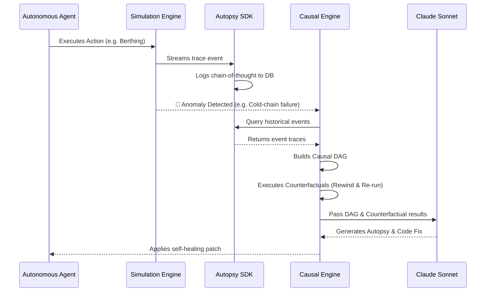

<div align="center">
  
  <br/><br/>
  <h1>⚓ PortAutopsy</h1>
  <p><b>Securing the Future of Autonomous Systems</b></p>
  <p>A 200-agent simulation where every decision is traced, every failure is analyzed, and causal intelligence rules.</p>
</div>

---

## 📖 Overview

**PortAutopsy** is a next-generation multi-agent network simulation and observability platform. 

Observing and debugging a highly concurrent, 200-agent system using traditional logs is practically impossible. PortAutopsy solves this by introducing a **Causal Intelligence Engine**. We simulate a high-stakes port environment where autonomous container-agents bid for limited resources. When chaos strikes—whether organic or injected—our Autopsy SDK automatically builds a Causal Directed Acyclic Graph (DAG), executes counterfactuals ("rewinding time"), and uses LLMs to generate a plain-English autopsy report complete with self-healing code patches.

---

## 🏆 FAR AWAY 2026 Hackathon Submission

**Themes Targeted:**
- 🤖 **Agentic & Autonomous Systems**: PortAutopsy features a complex ecosystem of agents that think, negotiate, and act independently, all overseen by an intelligent Causal Engine.
- 🚢 **Logistics & Transit**: We transform port resource allocation by predicting and healing bottlenecks in real-time, preventing cascading logistical failures.

### Addressing the Judging Criteria
- **Innovation & Technical Depth**: Moving beyond simple LLM wrappers, we built a true multi-agent deterministic simulation using custom DAG-based causal tracing and counterfactual "time-rewind" analysis.
- **Engineering Quality**: A robust Python/FastAPI backend utilizing WebSockets streams live data to a premium React frontend, handling thousands of concurrent agent events without polling latency.
- **Real-World Impact**: Container ports handle 90% of global trade. A single system failure can cost millions. PortAutopsy provides a blueprint for resilient, self-healing supply chain infrastructure.
- **Design & User Experience**: Our frontend is meticulously crafted as a high-stakes command center, transforming raw JSON traces into an intuitive, visually stunning experience (as seen in our premium landing page).
- **Execution Quality & Completeness**: From the foundational `@trace_agent` SDK to the fully functional simulation engine and interactive web app, the project is a complete, end-to-end product.

---

## 🏗️ System Architecture

The PortAutopsy ecosystem is built on four core pillars, designed for extreme concurrency, real-time observability, and AI-driven self-healing.

```mermaid
graph TD
    subgraph Frontend ["Interactive Dashboard (React)"]
        UI[Live Port Map & Agent Timeline]
        AP[Autopsy & Healing Panel]
    end

    subgraph Backend ["Real-Time Infra (FastAPI)"]
        WS[WebSocket Bridge]
        API[REST Endpoints]
    end

    subgraph Simulation ["Port Simulation Engine"]
        NL[Negotiation Loop]
        FI[Failure Injection Module]
        Agents[200 Autonomous Agents]
    end

    subgraph ML ["Causal Intelligence (ML)"]
        SDK[@trace_agent SDK]
        DAG[Causal DAG Builder]
        LLM[Claude Sonnet Analysis]
        DB[(SQLite Trace DB)]
    end

    UI <-->|WebSocket Streams| WS
    AP <-->|HTTP Requests| API

    WS --- NL
    API --- DAG
    
    Agents -->|Bid & Negotiate| NL
    FI -.->|Triggers Chaos| NL

    NL -->|Event Streams| SDK
    SDK -->|Persists Data| DB
    DB --> DAG
    DAG -->|Counterfactual Execution| LLM
```

### 1. The Port Simulation Engine (Backend)
At the core lies a highly concurrent Python-based negotiation loop. **200 autonomous container-agents** independently bid and negotiate for limited port resources (4 berths and 6 cranes). It manages complex constraints like cold-chain temperature tolerances, Hazmat clearance, and critical dwell-time targets. To stress-test the agents, a **Failure Injection Module** actively triggers deadlocks and silents constraint drops.

### 2. Causal Intelligence & The SDK (ML Track)
By wrapping any LLM agent call with our lightweight `@trace_agent` SDK decorator, the system automatically captures the agent's internal *chain-of-thought* alongside inputs and outputs. This streams into a centralized database.

### 3. Real-Time Infrastructure (FastAPI)
The entire backend is wrapped in a high-performance **FastAPI server**. As the simulation runs, an in-memory event bus pushes trace events through a **WebSocket Bridge** directly to the frontend, enabling zero-latency monitoring.

### 4. Interactive Dashboard (Frontend)
A dynamic React application that provides a sleek, high-stakes command center. It visualizes the port map, tracks live agent telemetry, and provides the interface for reviewing Autopsy Reports and deploying autonomous healing patches.

---

## 🔍 The Autopsy Flow (How it Works)

When a critical failure occurs in the simulation, PortAutopsy doesn't just throw an error code—it investigates.



---

## 🚀 Getting Started

To run the PortAutopsy simulation and dashboard locally:

### 1. Start the Backend (FastAPI + Simulation)
```bash
# From the root directory
uvicorn server:app --reload --port 8000
```

### 2. Start the Frontend (React + Vite)
```bash
cd frontend
npm install
npm run dev
```

The frontend will start on `http://localhost:5173` (or the port specified by Vite). You will be greeted by the cinematic premium landing page.

---

## 👥 The Team
- **Nischal** - Intelligence (ML) | *Causal DAG & Autopsy Agent*
- **Vaidik** - Backend Simulation | *Agent Negotiation Engine*
- **Smarak** - Real-Time Infra | *FastAPI & WebSockets*
- **Vinayak** - Interactive Dashboard | *React Visualizations*

---
<div align="center">
  <i>Built for the future of multi-agent networks.</i>
</div>
